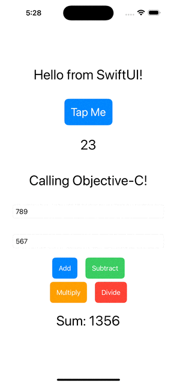

# Objective-C to SwiftUI Interoperability
--------------

Essentiallu, you keep the Objective-C 'shell' and use it to wrap a SwiftUI 'kernel'.

Depending on your needs, you can even have the two views live side-by-side on the same screen.

## Basic implementation

## Basic relationships

